# 🔍 Industrial Vision System for Automated Inspection

Today, most vision solutions are very expensive, costing thousands of dollars. In the automotive industry, these systems are widely used for simple vision tasks, like presence & absence detection.

**The solution:** A cheaper system, made with low-cost hardware and open-source software, able to perform on these simple applications with the help of `AI` and `classical computer vision tools`.

---

# 📚 Repository Contents
For a detailed explanation of the **computer vision tools**, please refer to the `docs` folder as it contains a markdown file.

```
docs/
└── VISION_TOOLS.md

media/

├── demo.mp4
└── screenshots/

README.md
```

---

# 🎥 Demo

https://github.com/user-attachments/assets/video

---

# 📌 Project Overview

A modular industrial machine vision platform developed for Raspberry Pi 5, integrating classical computer vision tools, AI for image classification, GPIO control for PLC communication, database management with SQLite, and a modern graphical user interface for real-time automated inspection.

- The software was designed from scratch using a modular architecture to **reduce code maintainence effort** in the future.
- An user-friendly GUI was designed in order to allow users to create vision applications **without deep knowledge in programming languages**. 

> **⚠️ Source Code Notice**
>
> This project was developed during a mechatronics engineering internship at **Bosch Manufacturing Solutions** and contains proprietary company intellectual property. Therefore, the source code cannot be publicly released.
>
> This repository showcases the system architecture, software design, capabilities, and demonstration of the project.

---

# 🧠 System Features

- 🔐 Multi-user authentication system
- 📄 Program management
- 📷 Camera configuration
- ⚡ I/O configuration
- 👁️ Vision tools management
- 🤖 Machine Learning classifier integration (training and image augmentation)
- 🛠️ Tools' logic
- 📊 System performance statistics
- 🧵 Multi-threaded processing

---

# 👨‍💻 OSS Technologies

Only the main OSS tools used in the project are listed below:

- `OpenCV`: Used for image processing
- `PySide6`: GUI development
- `Scikit-learn`: Image classifier training
- `SQLite3`: The programs are databases that contain data about camera parameters, I/O configuration, vision tools, etc.
- `Picamera2`: Used for camera control (exposure time, gains and resolution)
- `Gpiozero`: Used for GPIO control of the Raspberry Pi

---

# 🏗 System Workflow

```
 Trigger Signal (sent by PLC)
        │
        ▼
 Image Acquisition (PiCamera HQ)
        │
        ▼
 Image Preprocessing
        │
        ▼
 Tools Evaluation
        │
        ▼
 Decision Making (OK/NOK)
        │
        ▼
 Result Signal (sent by Raspberry)

```

---

# 💻 Software Architecture

In order to design a modular software architecture, different Python modules were created to manage each system's task with the help of **Object Oriented Programming**.

## 👁️ vision.py

Implements the computer vision algorithms used for inspection. Each inspection tool is encapsulated in its own class, making the system easily extensible.

**Implemented vision tools:**
- Position Adjustment
- AI Classifier
- Image Filters
- BLOB Analysis
- Color Mask

**Example methods:**
```
- detectTemplate()
- predictClass()
- binarizeImage()
- countBlobs()
- detectColor()
...
```

## 📷 camera.py

Provides a hardware abstraction layer for the industrial camera, handling image acquisition and camera parameter configuration independently of the rest of the system.

**Example methods:**
```
- getFrame()
- setExposureTime()
- setGlobalGain()
- setRedBlueGains()
- setResolution()
...
```

## 📄 database.py

Manages the SQLite database used to store and retrieve system configuration, user information, vision tool parameters, and program data.

**Example methods:**
```
- getUser()
- updateCameraParameters()
- updateTools()
- updateMasterImage()
- getIOConfiguration()
...
```

## ⚡ ioInterface.py

Handles communication between the Raspberry Pi and the PLC through the GPIO interface, managing input signals and inspection results.

**Example methods:**
```
- sendResult()
- readTriggerSignal()
- sendBusyState()
- sendErrorState()
...
```

## 🧵 threads.py

Manages the system's concurrent tasks using multithreading, allowing independent processes to run simultaneously without blocking the graphical user interface. This design improves system responsiveness and enables real-time operation.

**Example threads:**

- Camera Image Acquisition
- AI Model Training
- Digital Input Monitoring

## 🎯 roi.py

Provides interactive Region of Interest (ROI) widgets used to define inspection areas on the master image. Each ROI can be moved, resized, and independently configured, allowing users to precisely position inspection regions through the graphical interface.

**Main features:**

- Create ROI windows
- Move ROIs interactively
- Resize ROIs with drag handles
- Store ROI position and dimensions


```
Industrial Vision System

│

├── GUI
│   ├── Login
│   ├── Home
│   ├── Program Manager
│   ├── Vision Tools
│   ├── Statistics
│   └── Settings
│
├── Camera Module
│
├── Image Processing Module
│
├── Machine Learning Module
│
├── GPIO Controller
│
├── SQLite Database
│
├── User Management
│
└── Background Threads
```

---

# 🔄 Inspection Pipeline

```
Capture Image
      │
      ▼
Image Enhancement
      │
      ▼
ROI Extraction
      │
      ▼
Image Processing
      │
      ▼
Feature Extraction
      │
      ▼
Machine Learning
      │
      ▼
Classification
      │
      ▼
GPIO Output
      │
      ▼
Database Logging
```

---

# 🖥 GUI Overview

## Login
The user must select the username and type his password.

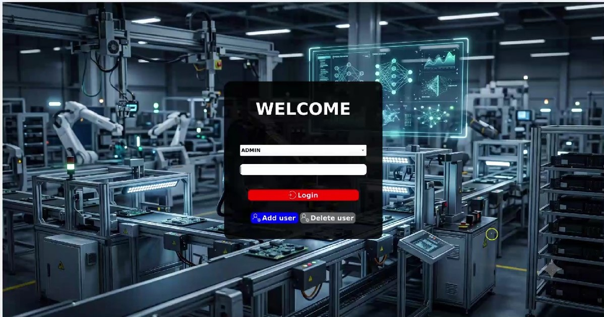

---

## Home (Project Page)
Programs are based on SQL databases and includes information about:
- Camera parameters
- Vision tools
- AI Models
- I/O configuration
- Logic settings

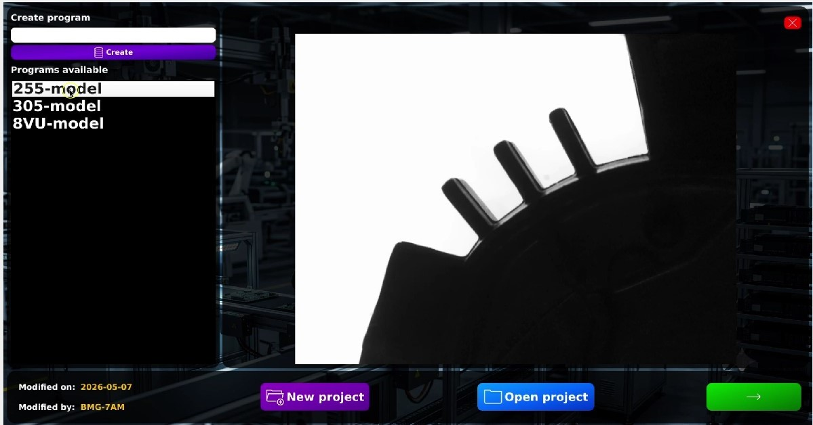

---

## Camera Configuration
The system's camera is the official Pi Camera HQ and the user can configure:
- Exposure time (0-100ms)
- Global, red and blue gains
- Color mode (RGB or Grayscale), useful when working with color lights
- Image orientation (angle and flips)
- Resolution
- Camera channel (Red, Green or Blue)

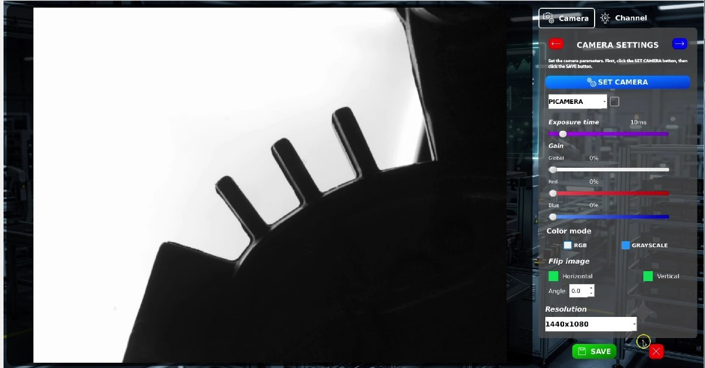

---

## Vision Tools & Master Image
Here's where all the vision tools are created.

At first, the master image must captured in order to define the "reference point" of the tools.
The position adjustment is based on template matching using OpenCV.

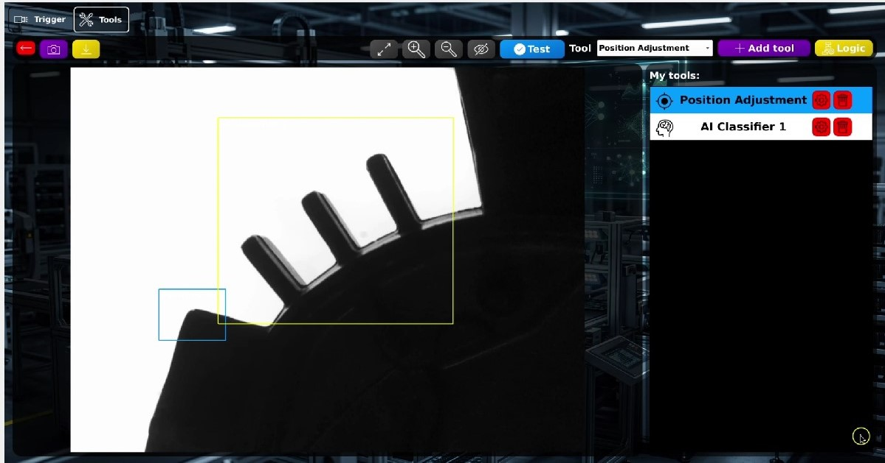

---

## AI Classifier - Sample Images
A ML-based binary image classifier implemented with scikit-learn.

In this section all the sample images (at least 15 per class) must be captured before training the model.

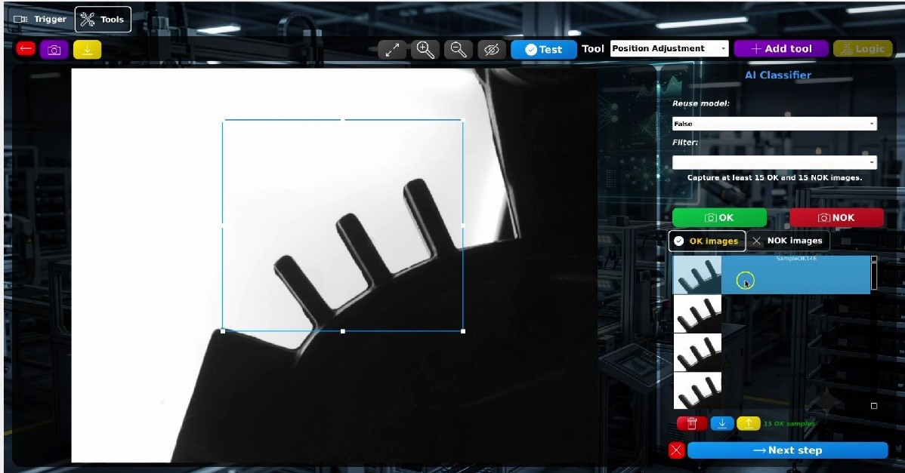

---

## AI Classifier - Custom Image Augmentation
Custom image augmentation techniques can be selected to improve the model performance against industrial environment variations: lighting and position.

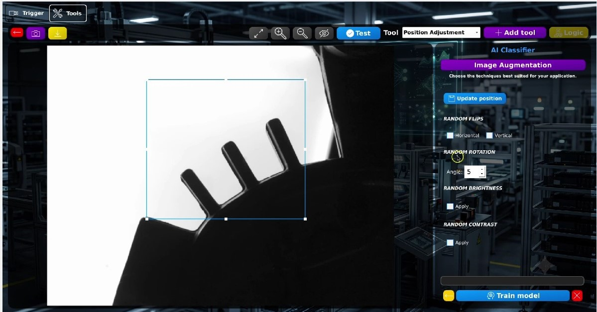

---

## Filter Tool
The system features the following filters to segmentate information from the image or improve quality (all filters have been implemented with OpenCV):
- Noise filter with custom kernel size (median filter)
- Sharpness
- Negative
- Binary (different types of binary filters featured in OpenCV)
- Histogram Equalization
- Contras & Brightness
- Auto Contrast (local histogram equalization)

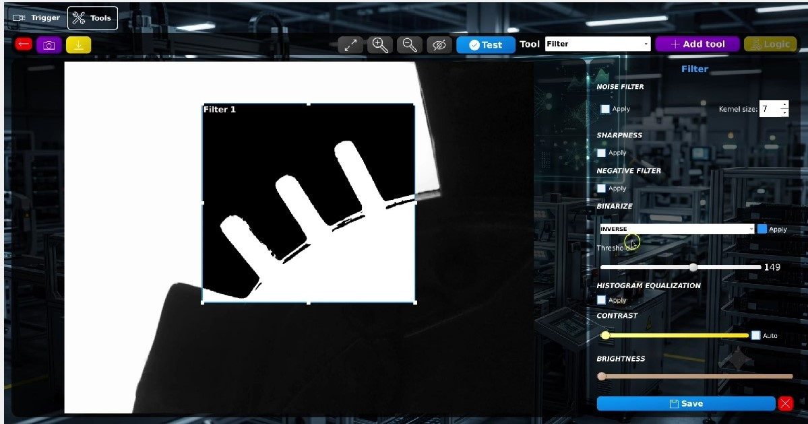

---

## BLOB Analysis Tool
Contours are extracted from the image and the user can suppres BLOBs above or below an area threshold. Different calculation can be performed:
- BLOB counting
- BLOB convexity
- BLOB area threshold

The evaluation logic can also be configured.

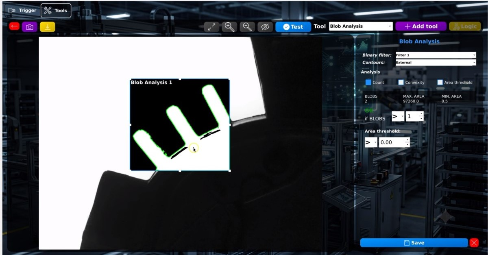

---

## Tools' Logic Settings
The tools' logic is used to define the final result of the inspection. The logical operator can be selected between AND/OR and also inverse individual results

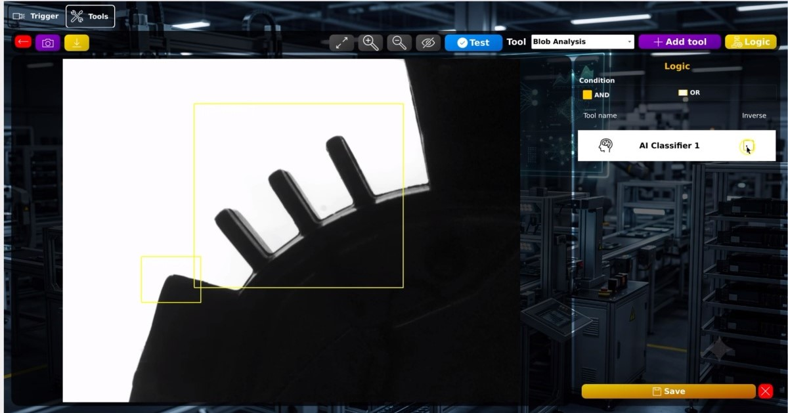

---

## I/O Management
The digital signals can be configured depending on the application.

**CHANGEOVER**
The system can store programs for up to 3 different part models. To start the changeover, the signal "start changeover" must be triggered first.

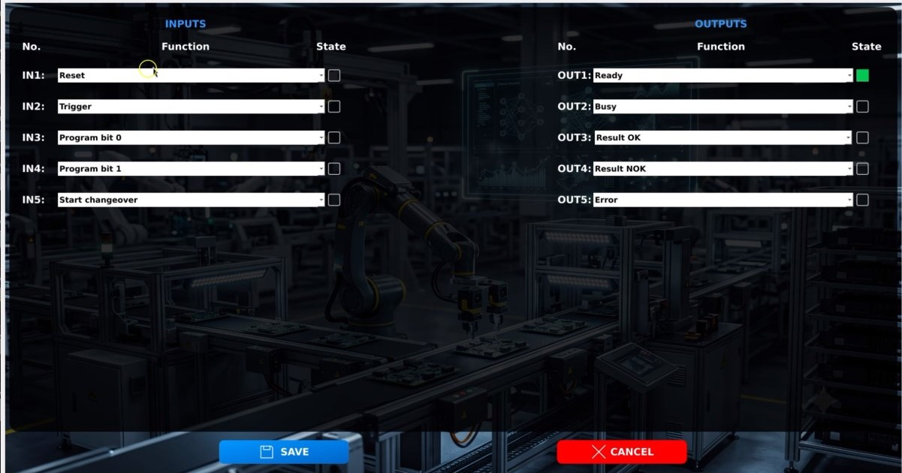

---

## Results
Current cycle time can be visualized at the top right corner. The system does not sacrifice performance.

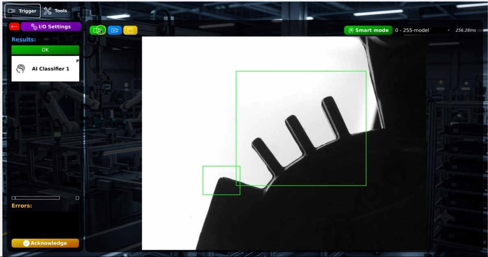


---

# 📈 Results

✅ Approximately **70% lower cost** than comparable commercial industrial vision systems.

✅ Real-time image processing.

✅ Modular architecture for rapid feature integration.

✅ Machine learning support.

✅ Industrial-grade graphical interface.

---

# 🔮 Future Improvements

- Deep Learning-based image classifier
- OCR inspection
- Barcode and QR reader
- USB cameras support
- More powerful controllers (ej. NVIDIA Jetson)

---

# 👨‍💻 Author

**Rafael Garcia Romero**

Mechatronics Engineering | Embedded Systems | Computer Vision |
Toluca, México

Email: rafaelgarciromero@gmail.com

---

# 📄 License

This repository is intended for portfolio purposes only.

The implementation presented here contains proprietary concepts developed during an engineering internship. Consequently, the source code is not publicly available.