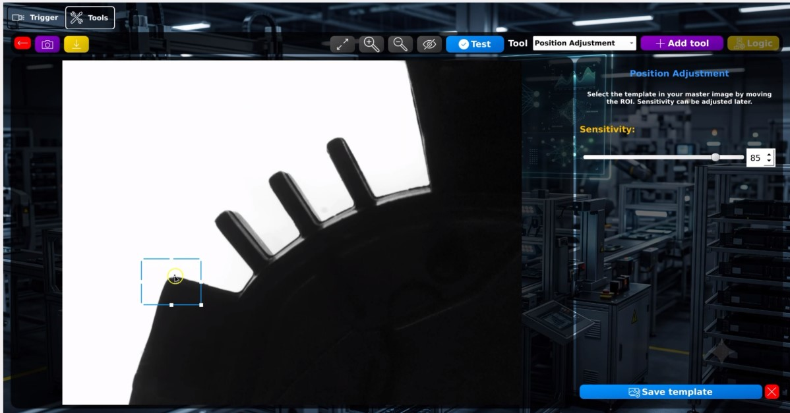
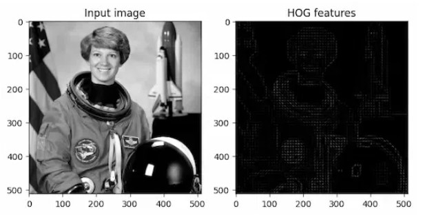
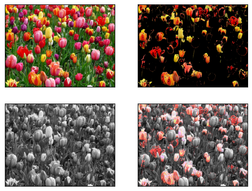

# 🧩 Vision Tools

The vision system provides the necessary collection of inspection tools to perform on presence & absence detection. These can be combined to create complete industrial inspection programs.

---

## Technology

<p align="left">
  
  
</p>

---

## 📍 Position Adjustment

Aligns the inspected part with the reference image before any inspection is performed.

### Features

- Template Matching based on **OpenCV**
- Automatically compensates for part displacement
- Configurable matching acceptance threshold (**1–100%**)
- Improves inspection repeatability by ensuring all subsequent tools operate on an aligned image



---

## 🤖 AI Classifier

Machine learning tool used to classify parts into OK/NOK.

### Features

- Support Vector Machine (**SVM**) classifier implemented with **scikit-learn**
- Automatic hyperparameter optimization using **Grid Search**
- Robust model evaluation using **Cross Validation**
- Custom image augmentation pipeline configurable by the user
- Trained models are serialized and stored directly in the SQLite database as **BLOB** objects
- Enables creation of inspection models without modifying application code

### Feature Extraction

The algorithm uses **HOG (histogram of oriented gradients)** as the input features, making it **more robust** against variations in:
- Position
- Orientation
- Illumination.



### Image Augmentation

Users can select which augmentation techniques to apply during training, allowing the model to become more robust against production variations such as:

- Rotation
- Brightness changes
- Contrast variations
- Flipping


---

## 🎨 Image Filters

Collection of preprocessing filters used to improve image quality before inspection.

### Available Filters

| Filter | Description |
|---------|-------------|
| **Noise Filter** | Median filter with configurable kernel size for impulse noise removal |
| **Sharpness** | Enhances image details and edges |
| **Negative** | Inverts image intensity values |
| **Binary** | Multiple OpenCV binary thresholding methods |
| **Histogram Equalization** | Improves global image contrast |
| **Brightness & Contrast** | Uses OpenCV `convertScaleAbs()` |
| **Auto Contrast (CLAHE)** | Adaptive local histogram equalization for uneven lighting conditions |


---

## 🔍 BLOB Analysis

Performs measurements over connected binary regions extracted from thresholded images.

### Features

- Works exclusively with **binary images** (binary filter or color mask)
- Supports extraction of:
  - External contours
  - External and internal contours
- Multiple measurement methods available (counting, convexity, area threshold)

### Available Measurements

| Measurement | Description |
|------------|-------------|
| **Count** | Counts the number of detected blobs |
| **Convexity** | Evaluates the convexity of detected objects |
| **Area Threshold** | Filters blobs according to their area |


---

## 🎯 Color Mask

Segments objects according to their color in the HSV color space.

### Processing Pipeline

1. Convert RGB image to **HSV**
2. Define lower and upper limits for:
   - Hue (H)
   - Saturation (S)
   - Value (V)
3. Generate a binary mask containing only pixels inside the selected range

### Features

- Interactive HSV threshold adjustment
- Robust color segmentation under varying illumination
- Binary mask output compatible with subsequent inspection tools such as BLOB Analysis



---

## 🔄 Modular Inspection Pipeline

Each vision tool can be combined to build complete inspection workflows. A typical pipeline may look like:

```text
Image Acquisition
        │
        ▼
Position Adjustment
        │
        ▼
Image Filters
        │
        ▼
Color Mask
        │
        ▼
BLOB Analysis
        │
        ▼
AI Classifier
        │
        ▼
Inspection Result (OK / NOK)
```

This modular architecture allows new vision tools to be added with minimal modifications to the system while keeping inspection programs scalable and easy to maintain.